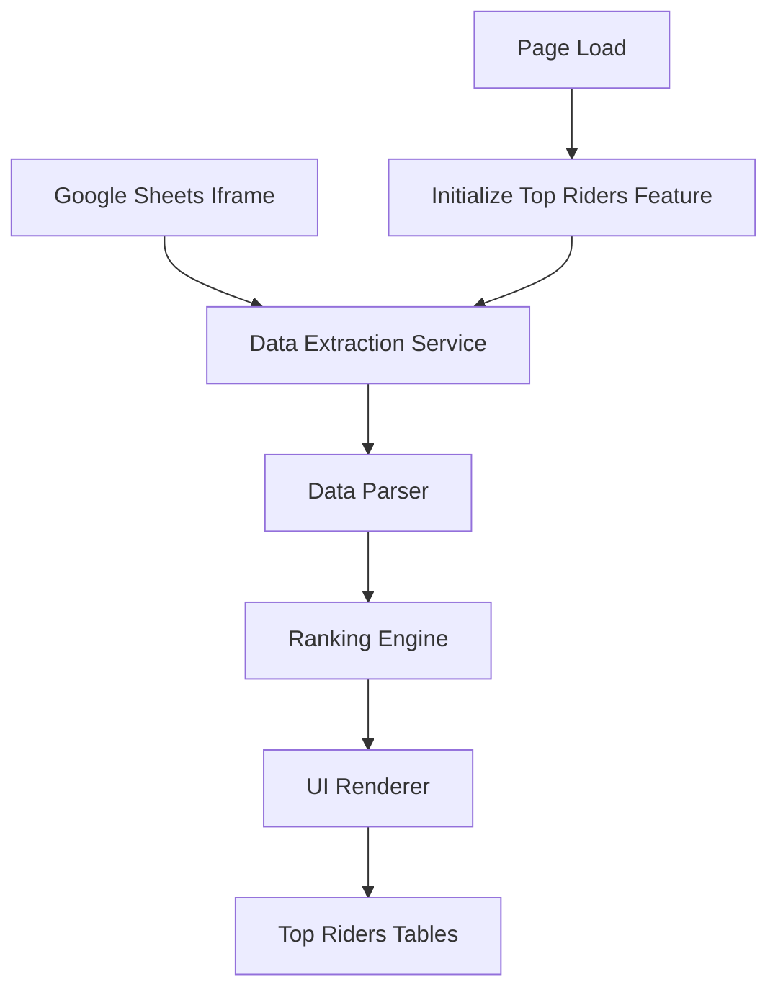

# Design Document

## Overview

The top riders table feature will enhance the existing Galway Summer League 2025 standings page by adding a client-side JavaScript solution that extracts data from the embedded Google Sheets and displays summarized top rider information in dedicated tables. The solution will be implemented as a pure frontend enhancement that integrates seamlessly with the existing static HTML structure.

## Architecture

The feature will use a client-side approach with the following key components:

1. **Data Extraction Layer**: JavaScript module to parse Google Sheets data from the existing iframe
2. **Data Processing Layer**: Logic to identify and rank top riders from different categories
3. **UI Rendering Layer**: Dynamic HTML table generation and styling
4. **Integration Layer**: Seamless integration with existing page layout and styling

### Data Flow



## Components and Interfaces

### 1. GoogleSheetsExtractor

**Purpose**: Extract raw data from the embedded Google Sheets iframe

**Key Methods**:
- `extractSheetData()`: Attempts to access iframe content and extract table data
- `parseCSVData(csvUrl)`: Alternative method using Google Sheets CSV export URL
- `handleCORSRestrictions()`: Fallback mechanisms for cross-origin restrictions

**Interface**:
```javascript
class GoogleSheetsExtractor {
  async extractSheetData(): Promise<RawSheetData>
  async parseCSVData(csvUrl: string): Promise<RawSheetData>
  handleDataExtractionError(error: Error): void
}
```

### 2. RiderDataParser

**Purpose**: Parse and structure raw sheet data into usable rider objects

**Key Methods**:
- `parseMainLeague(rawData)`: Extract ML standings
- `parseDevelopmentLeague(rawData)`: Extract DL standings  
- `parsePrimeTables(rawData)`: Extract both Prime table standings
- `validateDataStructure(data)`: Ensure data integrity

**Interface**:
```javascript
class RiderDataParser {
  parseMainLeague(rawData: RawSheetData): Rider[]
  parseDevelopmentLeague(rawData: RawSheetData): Rider[]
  parsePrimeTables(rawData: RawSheetData): { prime1: Rider[], prime2: Rider[] }
  validateDataStructure(data: any): boolean
}
```

### 3. RankingEngine

**Purpose**: Sort and filter riders to get top performers

**Key Methods**:
- `getTopRiders(riders, count)`: Get top N riders by points
- `sortByPoints(riders)`: Sort riders by total points descending
- `filterValidEntries(riders)`: Remove invalid or incomplete entries

**Interface**:
```javascript
class RankingEngine {
  getTopRiders(riders: Rider[], count: number): Rider[]
  sortByPoints(riders: Rider[]): Rider[]
  filterValidEntries(riders: Rider[]): Rider[]
}
```

### 4. TopRidersRenderer

**Purpose**: Generate and display HTML tables for top riders

**Key Methods**:
- `renderTopRidersSection()`: Create complete top riders section
- `createLeagueTable(riders, title)`: Generate individual league table
- `createPrimeTable(riders, title)`: Generate prime competition table
- `applyResponsiveStyles()`: Ensure mobile compatibility

**Interface**:
```javascript
class TopRidersRenderer {
  renderTopRidersSection(topRidersData: TopRidersData): HTMLElement
  createLeagueTable(riders: Rider[], title: string): HTMLElement
  createPrimeTable(riders: Rider[], title: string): HTMLElement
  applyResponsiveStyles(): void
}
```

## Data Models

### Rider Model
```javascript
interface Rider {
  name: string;
  position: number;
  points: number;
  club?: string;
  category: 'ML' | 'DL' | 'Prime1' | 'Prime2';
}
```

### TopRidersData Model
```javascript
interface TopRidersData {
  mainLeague: Rider[];      // Top 10 ML riders
  developmentLeague: Rider[]; // Top 10 DL riders
  prime1: Rider[];          // Top 5 Prime 1 riders
  prime2: Rider[];          // Top 5 Prime 2 riders
  lastUpdated: Date;
}
```

### RawSheetData Model
```javascript
interface RawSheetData {
  sheets: SheetTab[];
  extractedAt: Date;
}

interface SheetTab {
  name: string;
  data: string[][];
}
```

## Error Handling

### Data Extraction Errors
- **CORS Restrictions**: Implement fallback to CSV export URL
- **Network Failures**: Display cached data with timestamp warning
- **Invalid Sheet Structure**: Show error message with manual refresh option

### Data Processing Errors
- **Missing Data**: Handle incomplete rider entries gracefully
- **Parsing Failures**: Log errors and continue with available data
- **Invalid Rankings**: Filter out malformed entries

### UI Rendering Errors
- **DOM Manipulation Failures**: Fallback to basic table structure
- **Styling Issues**: Ensure core functionality works without CSS
- **Responsive Layout Problems**: Provide horizontal scroll for narrow screens

## Testing Strategy

### Unit Testing
- Test data extraction with mock Google Sheets responses
- Validate parsing logic with sample sheet data
- Test ranking algorithms with various rider datasets
- Verify HTML generation produces valid markup

### Integration Testing
- Test complete data flow from extraction to rendering
- Verify error handling across component boundaries
- Test responsive behavior on different screen sizes
- Validate accessibility compliance

### End-to-End Testing
- Test with actual Google Sheets data
- Verify real-time data updates
- Test error scenarios (network failures, invalid data)
- Cross-browser compatibility testing

### Performance Testing
- Measure data extraction and processing time
- Test with large datasets (100+ riders)
- Monitor memory usage during data processing
- Validate smooth user experience during updates

## Implementation Considerations

### Google Sheets Access Strategy
Due to CORS restrictions, the primary approach will be:
1. **Primary**: Use Google Sheets CSV export URL (publicly accessible)
2. **Fallback**: Attempt iframe content access where possible
3. **Cache**: Store processed data in localStorage for offline viewing

### Responsive Design
- Tables will stack vertically on mobile devices
- Horizontal scrolling for table overflow
- Collapsible sections for better mobile UX
- Touch-friendly interface elements

### Performance Optimization
- Lazy loading of data processing
- Debounced refresh mechanisms
- Minimal DOM manipulation
- CSS-based animations for smooth transitions

### Browser Compatibility
- ES6+ features with appropriate polyfills
- Graceful degradation for older browsers
- Progressive enhancement approach
- Accessible markup and ARIA labels